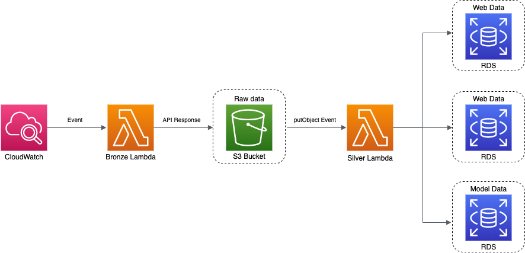

# About
A serverless scraper for czech estates and properties running on AWS. 
(WIP) Machine learning model for predicting rental prices built on top of scraped data.

# Architecture

# Project Organization
------------
    ├── LICENSE
    ├── Makefile           <- Makefile with commands like `make bronze` or `make silver`
    ├── README.md          <- The top-level README for developers using this project.
    ├── data
    │   ├── bronze         <- Raw data from Sreality API.
    │   ├── silver         <- Semi-preprocessed data (image links, data for web and model).
    │   └── gold           <- Preprocessed data for machine learning model.
    │
    ├── models             <- Trained and serialized models, model predictions, or model summaries
    │
    ├── notebooks          <- Jupyter notebooks. Number for ordering in name,
    │                         e.g. `01_initial_data_exploration`.
    │
    ├── references         <- Data dictionaries, manuals, and all other explanatory materials.
    │
    ├── pyproject.toml     <- Python dev/prod dependencies,
    ├── poetry.lock           'poetry install' to install or 'make environment'
    │
    ├── environment.yaml   <- To 'cold-start' a clean conda environment with Python 3.8
    │
    ├── src                <- Source code for use in this project.
    │   │
    │   ├── data           <- Lambda functions for each of the data layers
    │   │   │
    │   │   ├── bronze     <- Scrapes Sreality API for estate listings and saves to S3
    │   │   │
    │   │   ├── silver     <- S3 event triggered, preprocesses and saves to RDS
    │   │   │
    │   │   └── gold       <- (WIP) Saves 
    │   │
    │   ├── features       <- Scripts to turn raw data into features for modeling
    │   │   └── build_features.py
    │   │
    │   ├── models         <- Scripts to train models and then use trained models to make
    │   │   │                 predictions
    │   │   ├── predict_model.py
    │   │   └── train_model.py
    │
    └── .travis.yml        <- Travis CI/CD configuration file
--------

# Back Log
- **[Medium]** Save pandas, numpy, psycopg2 (and other libraries) as a Lambda layer and simplify Makefile
- **[Low]** Use serverless framework (?)
- **[High]** Error handling for Bronze layer failure
- **[High]** Model for rental prices
- **[Medium]** Retrain model periodically (EC2? Docker?)
- **[Medium]** Serve model as API
- **[Medium]** Unit tests, mainly for silver